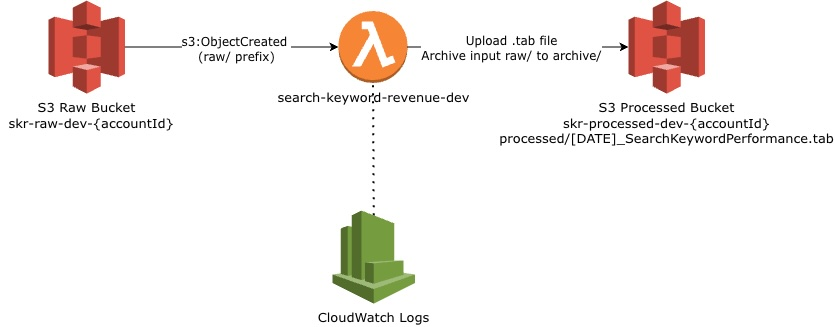

# acs-hit-level-analytics

Adobe Analytics Search Keyword Performance Pipeline.  
Reads hit-level TSV data and produces a revenue-by-keyword report, deployed as an AWS Lambda triggered by S3.

---

## What It Does

Processes Adobe Analytics hit-level export files and outputs a ranked report of e-commerce revenue attributed to search engine keywords (Google, Bing, Yahoo, MSN).

**Input:** tab-separated hit-level file with 12 columns (IP, referrer, event_list, product_list, …)  
**Output:** `[YYYY-MM-DD]_SearchKeywordPerformance.tab`

```
Search Engine Domain    Search Keyword    Revenue
google.com              ipod              480.00
bing.com                zune              250.00
```

---

## Architecture



### AWS Resources

| Resource | Name |
|---|---|
| S3 raw bucket | `skr-raw-dev-{accountId}` |
| S3 processed bucket | `skr-processed-dev-{accountId}` |
| Lambda function | `search-keyword-revenue-dev` |
| IAM role | `skr-lambda-role-dev` |
| CloudWatch log group | `/aws/lambda/search-keyword-revenue-dev` |

---

## Quick Start

```bash
git clone git@github.com:hsagar/acs-hit-level-analytics.git
cd acs-hit-level-analytics

make install    # install dependencies
make test       # run tests
make lint       # lint check
make run        # process sample_input.tsv locally
```

---

## Documentation

| Guide | Description |
|---|---|
| [docs/aws-setup.md](docs/aws-setup.md) | Prerequisites, AWS account, CLI and SAM installation |
| [docs/deployment.md](docs/deployment.md) | IAM permissions, SAM first-time deploy, teardown |
| [docs/cicd.md](docs/cicd.md) | GitHub Actions pipeline, secrets configuration |
| [docs/operations.md](docs/operations.md) | Running the pipeline, monitoring, troubleshooting |

---

## Key Files

| File | Purpose |
|---|---|
| [infrastructure/template.yaml](infrastructure/template.yaml) | SAM template — defines all AWS resources |
| [src/search_keyword_revenue/lambda_handler.py](src/search_keyword_revenue/lambda_handler.py) | Lambda entry point |
| [src/search_keyword_revenue/parser.py](src/search_keyword_revenue/parser.py) | Core pipeline logic |
| [.github/workflows/cicd.yml](.github/workflows/cicd.yml) | CI/CD pipeline |
