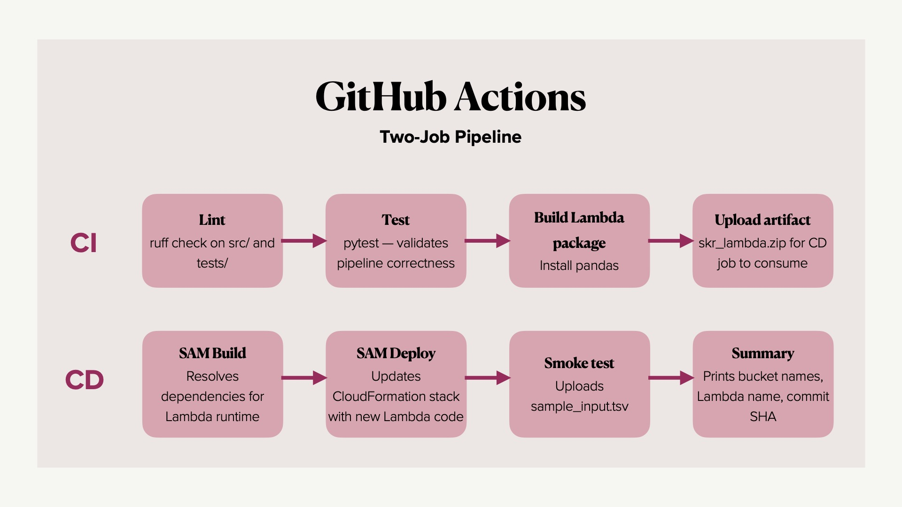

# CI/CD Pipeline

The pipeline is defined in [.github/workflows/cicd.yml](../.github/workflows/cicd.yml).

---

## Branch Behaviour

| Branch | CI (lint + test) | CD (deploy) |
|---|---|---|
| `feature/**` | Yes | No |
| `develop` | Yes | No |
| `main` | Yes | Yes |

---

## CI/CD Jobs

---

## GitHub Secrets

| Secret | Description |
|---|---|
| `AWS_ACCESS_KEY_ID` | Access key ID for `skr-deployer` |
| `AWS_SECRET_ACCESS_KEY` | Secret access key for `skr-deployer` |
| `AWS_ACCOUNT_ID` | AWS account ID |
| `SAM_ARTIFACTS_BUCKET` | SAM artifact bucket |
